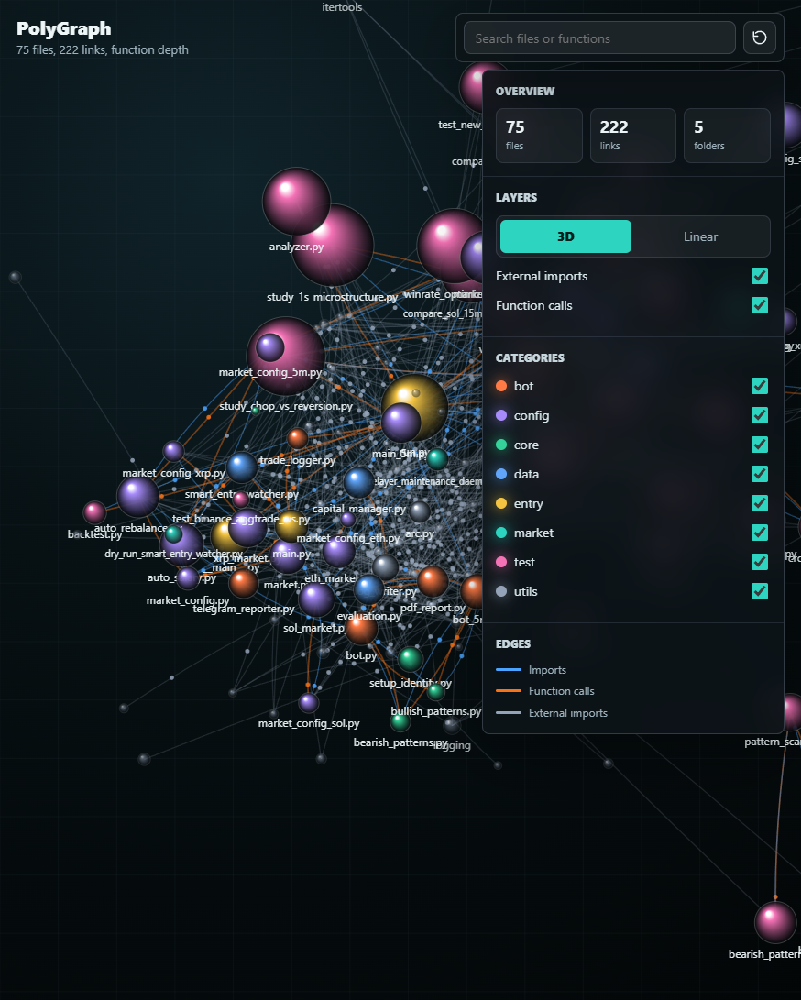
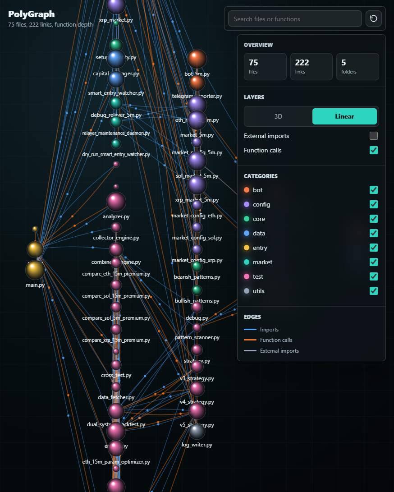

# PolyGraph

PolyGraph is a local codebase visualizer for Python projects. It scans source files with the standard library `ast` module and writes:

- `graph_data.json`: extracted files, definitions, imports, and best-effort call edges
- `graph.html`: a self-contained local 3D graph viewer

No server is required. Open the generated HTML file in a browser.

## Examples

### 3D Dependency View



### Linear Flow View



## Usage

```powershell
python polygraph.py --path . --output graph.html
python polygraph.py --path C:\path\to\project --output graph.html --depth import
python polygraph.py --path C:\path\to\project --output graph.html --depth function
```

Bare output filenames are written into the `graphs/` folder by default, so the repo root stays clean:

```powershell
python polygraph.py --path C:\Users\pc\Desktop\poly --output poly_graph.html
start graphs\poly_graph.html
```

## What Gets Mapped

- Python files as nodes
- File size as node size
- Categories from file names and imports
- Local imports as blue links
- Best-effort cross-file function calls as orange links
- External imports as optional ghost nodes in the viewer

## Controls

- Drag to rotate in 3D view
- Drag to rotate the flat Linear view
- Right-drag to pan
- Mouse wheel to zoom
- Search by file, function, class, or import
- Switch between 3D and Linear views
- Toggle categories, external imports, and function-call links
